---
## Front matter
lang: ru-RU
title: Презентация по лабораторной работе №4
subtitle: "Основы интерфейса взаимодействия пользователя с системой Unix на уровне командной строки"
author:
  - Шуваев Сергей
institute:
  - Российский университет дружбы народов, Москва, Россия
date: 02.03.2023

## i18n babel
babel-lang: russian
babel-otherlangs: english

## Formatting pdf
toc: false
toc-title: Содержание
slide_level: 2
aspectratio: 169
section-titles: true
theme: metropolis
header-includes:
 - \metroset{progressbar=frametitle,sectionpage=progressbar,numbering=fraction}
 - '\makeatletter'
 - '\beamer@ignorenonframefalse'
 - '\makeatother'
---

## Цель работы

Приобретение практических навыков взаимодействия пользователя с системой посредством командной строки.

## Задание

1. Определите полное имя вашего домашнего каталога. Далее относительно этого каталога будут выполняться последующие упражнения.
2. Выполните следующие действия:
2.1. Перейдите в каталог /tmp.
2.2. Выведите на экран содержимое каталога /tmp. Для этого используйте команду ls
с различными опциями. Поясните разницу в выводимой на экран информации.
2.3. Определите, есть ли в каталоге /var/spool подкаталог с именем cron?
2.4. Перейдите в Ваш домашний каталог и выведите на экран его содержимое. Определите, кто является владельцем файлов и подкаталогов?
3. Выполните следующие действия:
3.1. В домашнем каталоге создайте новый каталог с именем newdir.
3.2. В каталоге ~/newdir создайте новый каталог с именем morefun.
3.3. В домашнем каталоге создайте одной командой три новых каталога с именами
letters, memos, misk. Затем удалите эти каталоги одной командой.
3.4. Попробуйте удалить ранее созданный каталог ~/newdir командой rm. Проверьте,
был ли каталог удалён.
3.5. Удалите каталог ~/newdir/morefun из домашнего каталога. Проверьте, был ли
каталог удалён.
4. С помощью команды man определите, какую опцию команды ls нужно использовать для просмотра содержимое не только указанного каталога, но и подкаталогов,
входящих в него.
5. С помощью команды man определите набор опций команды ls, позволяющий отсортировать по времени последнего изменения выводимый список содержимого каталога
с развёрнутым описанием файлов.
6. Используйте команду man для просмотра описания следующих команд: cd, pwd, mkdir,
rmdir, rm. Поясните основные опции этих команд.
7. Используя информацию, полученную при помощи команды history, выполните модификацию и исполнение нескольких команд из буфера команд.
Здесь описываются теоретические аспекты, связанные с выполнением работы.
Например, в табл. @tbl:std-dir приведено краткое описание стандартных каталогов Unix.
Описание некоторых каталогов файловой системы GNU Linux {#tbl:std-dir}

{#fig:001 width=70%}

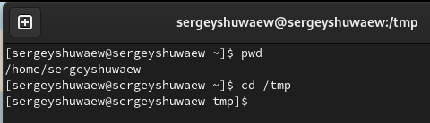{#fig:002 width=70%}

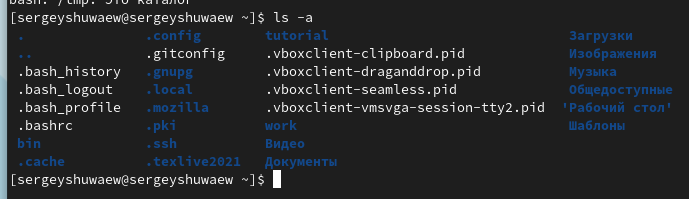{#fig:003 width=70%}

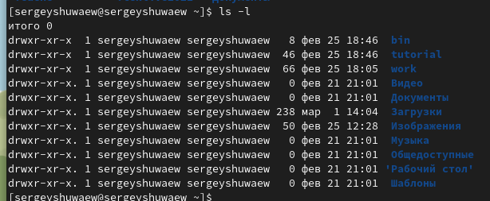{#fig:003 width=70%}

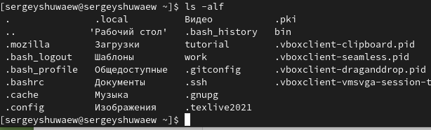{#fig:003 width=70%}

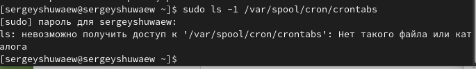{#fig:003 width=70%}

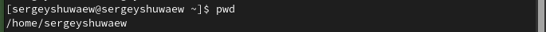{#fig:002 width=70%}

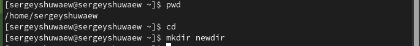{#fig:003 width=70%}

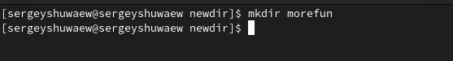{#fig:003 width=70%}

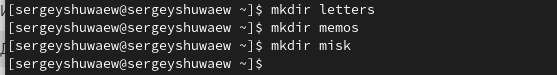{#fig:003 width=70%}

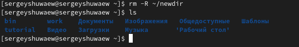{#fig:003 width=70%}

{#fig:002 width=70%}

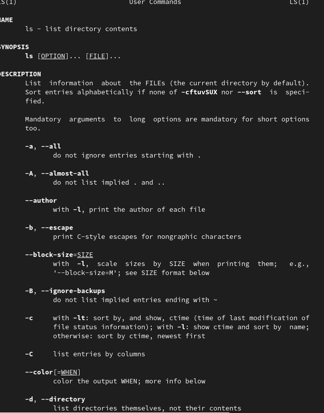{#fig:002 width=70%}

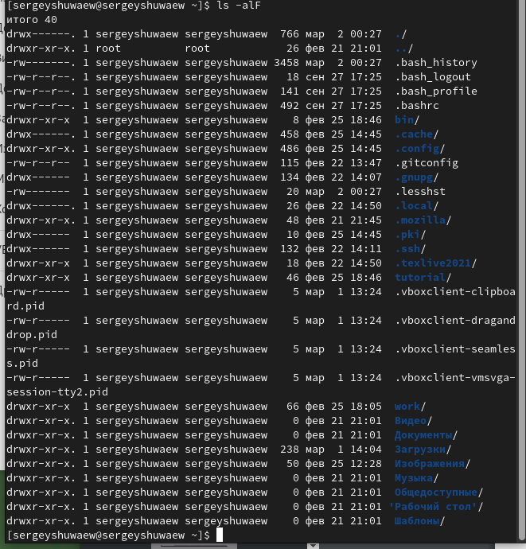{#fig:002 width=70%}

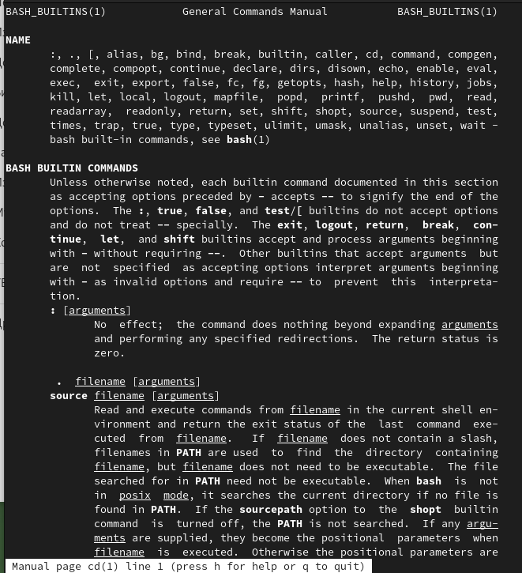{#fig:002 width=70%}

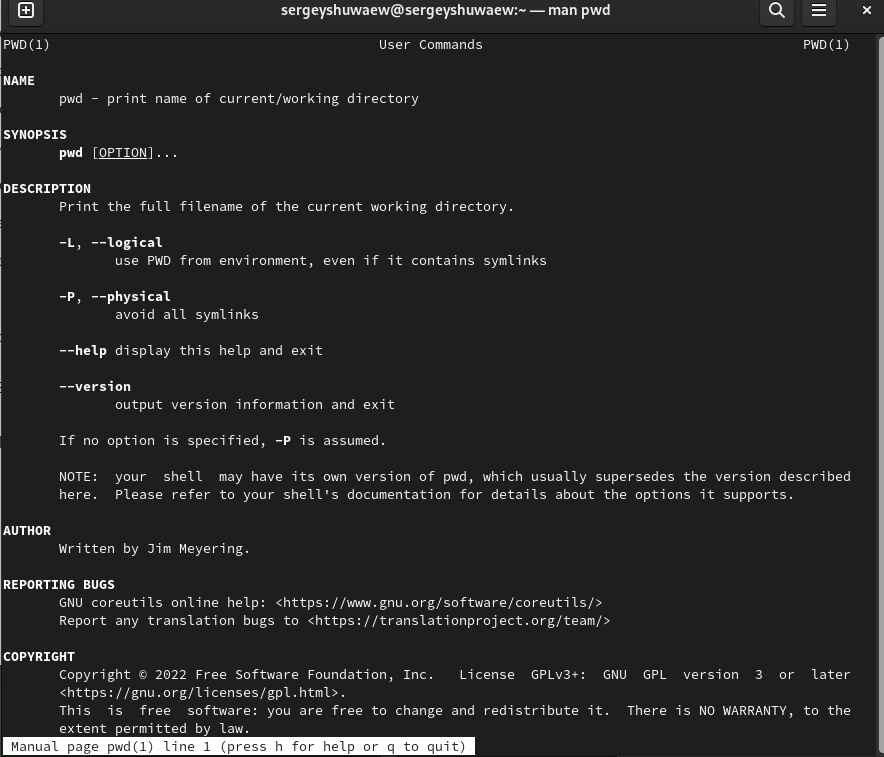{#fig:002 width=70%}

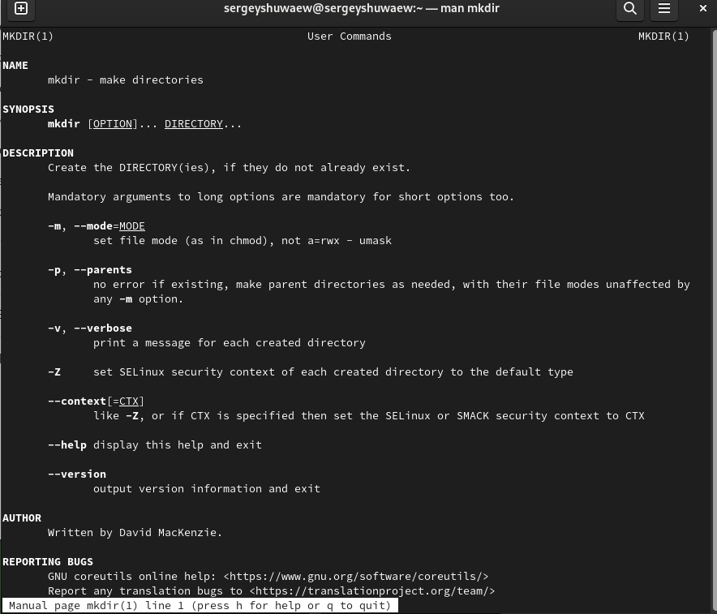{#fig:002 width=70%}

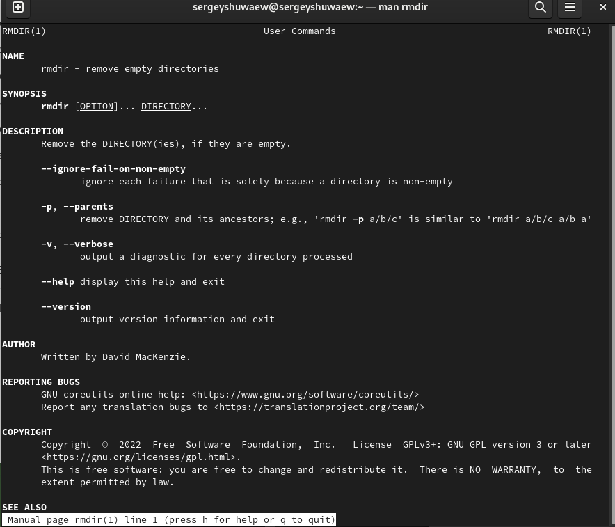{#fig:002 width=70%}

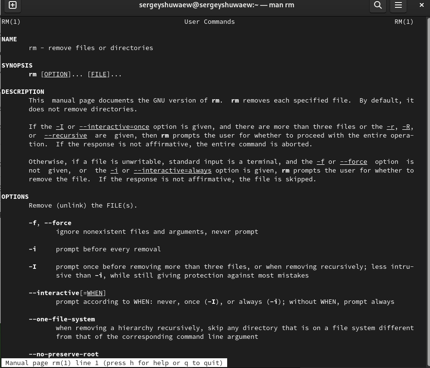{#fig:002 width=70%}

## Выводы

Научился пользоваться командной строкой,выучил определенные команды в командной строке для создания,перемещения,просмотра,переименования,

# Спасибо за внимание!

