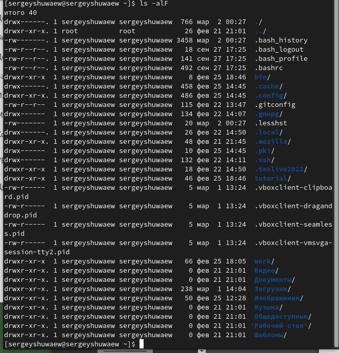
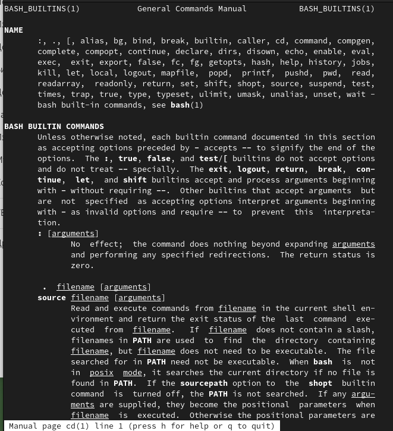
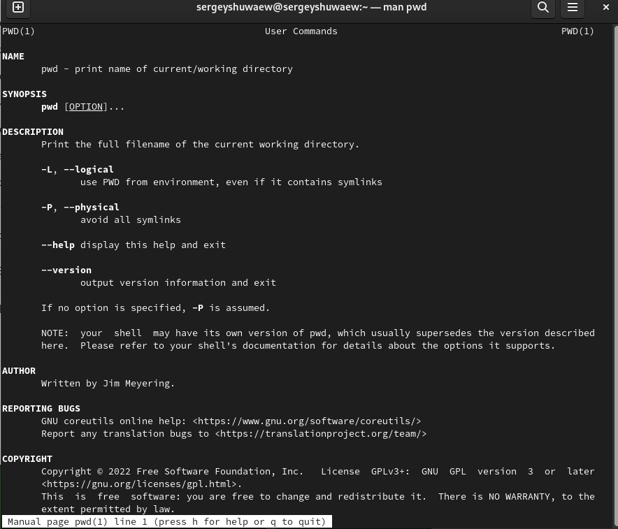

---
## Front matter
title: "Отчёт по лабораторной работе №4"
subtitle: "Основы интерфейса взаимодействия пользователя с системой Unix на уровне командной строки"
author: "Шуваев Сергей Александрович"

## Generic otions
lang: ru-RU
toc-title: "Содержание"

## Bibliography
bibliography: bib/cite.bib
csl: pandoc/csl/gost-r-7-0-5-2008-numeric.csl

## Pdf output format
toc: true # Table of contents
toc-depth: 2
lof: true # List of figures
lot: true # List of tables
fontsize: 12pt
linestretch: 1.5
papersize: a4
documentclass: scrreprt
## I18n polyglossia
polyglossia-lang:
  name: russian
  options:
	- spelling=modern
	- babelshorthands=true
polyglossia-otherlangs:
  name: english
## I18n babel
babel-lang: russian
babel-otherlangs: english
## Fonts
mainfont: PT Serif
romanfont: PT Serif
sansfont: PT Sans
monofont: PT Mono
mainfontoptions: Ligatures=TeX
romanfontoptions: Ligatures=TeX
sansfontoptions: Ligatures=TeX,Scale=MatchLowercase
monofontoptions: Scale=MatchLowercase,Scale=0.9
## Biblatex
biblatex: true
biblio-style: "gost-numeric"
biblatexoptions:
  - parentracker=true
  - backend=biber
  - hyperref=auto
  - language=auto
  - autolang=other*
  - citestyle=gost-numeric
## Pandoc-crossref LaTeX customization
figureTitle: "Рис."
tableTitle: "Таблица"
listingTitle: "Листинг"
lofTitle: "Список иллюстраций"
lotTitle: "Список таблиц"
lolTitle: "Листинги"
## Misc options
indent: true
header-includes:
  - \usepackage{indentfirst}
  - \usepackage{float} # keep figures where there are in the text
  - \floatplacement{figure}{H} # keep figures where there are in the text
---

# Цель работы

Приобретение практических навыков взаимодействия пользователя с системой посредством командной строки.

# Задание

1. Определите полное имя вашего домашнего каталога. Далее относительно этого каталога будут выполняться последующие упражнения.
2. Выполните следующие действия:
2.1. Перейдите в каталог /tmp.
2.2. Выведите на экран содержимое каталога /tmp. Для этого используйте команду ls
с различными опциями. Поясните разницу в выводимой на экран информации.
2.3. Определите, есть ли в каталоге /var/spool подкаталог с именем cron?
2.4. Перейдите в Ваш домашний каталог и выведите на экран его содержимое. Определите, кто является владельцем файлов и подкаталогов?
3. Выполните следующие действия:
3.1. В домашнем каталоге создайте новый каталог с именем newdir.
3.2. В каталоге ~/newdir создайте новый каталог с именем morefun.
3.3. В домашнем каталоге создайте одной командой три новых каталога с именами
letters, memos, misk. Затем удалите эти каталоги одной командой.
3.4. Попробуйте удалить ранее созданный каталог ~/newdir командой rm. Проверьте,
был ли каталог удалён.
3.5. Удалите каталог ~/newdir/morefun из домашнего каталога. Проверьте, был ли
каталог удалён.
4. С помощью команды man определите, какую опцию команды ls нужно использовать для просмотра содержимое не только указанного каталога, но и подкаталогов,
входящих в него.
5. С помощью команды man определите набор опций команды ls, позволяющий отсортировать по времени последнего изменения выводимый список содержимого каталога
с развёрнутым описанием файлов.
6. Используйте команду man для просмотра описания следующих команд: cd, pwd, mkdir,
rmdir, rm. Поясните основные опции этих команд.
7. Используя информацию, полученную при помощи команды history, выполните модификацию и исполнение нескольких команд из буфера команд.
Здесь описываются теоретические аспекты, связанные с выполнением работы.
Например, в табл. @tbl:std-dir приведено краткое описание стандартных каталогов Unix.
Описание некоторых каталогов файловой системы GNU Linux {#tbl:std-dir}

# Теоретическое введение
[@UNIX:bash]
История ОС UNIX началась в 1969 году в одном из подразделений AT&T Bell Laboratories, когда на "малоиспользуемой" машине DEC PDP-7 Кен Томпсон (Ken Thompson), Деннис Ричи (Dennis Ritchie) и другие (прежде занимавшиеся созданием ОС Multics) начали работу над операционной системой, названной ими первоначально Unics (UNiplexed Information and Computing System). В течение первых 10 лет развитие UNIX происходило, в основном, в Bell Labs. Соответствующие начальные версии назывались "Version n" (Vn) и предназначались для ЭВМ DEC PDP-11 (16-битовая) и VAX (32-битовая).
Версии Vn разрабатывались группой Computer Research Group (CRG) в Bell Labs. Поддержкой занималась другая группа, Unix System Group (USG). Разработкой также занималась группа Programmer's WorkBench (PWB), привнесшая систему управления исходным кодом sccs, именованные каналы и ряд других идей. В 1983 году эти группы были объединены в одну, Unix System Development Lab.
Основные характеристики ОС UNIX имеет следующие основные характеристики:переносимость;вытесняющая многозадачность на основе процессов, работающих в изолированных адресных пространствах в виртуальной памяти;поддержка одновременной работы многих пользователей;
оддержка асинхронных процессов;иерархическая файловая система;поддержка независимых от устройств операций ввода-вывода (через специальные файлы устройств);стандартный интерфейс для программ (программные каналы, IPC) и пользователей (командный интерпретатор, не входящий в ядро ОС);
встроенные средства учета использования системы.
Архитектура ОС UNIX
Архитектура ОС UNIX - многоуровневая. На нижнем уровне, непосредственно над оборудованием, работает ядро операционной системы. Функции ядра доступны через интерфейс системных вызовов, образующих второй уровень. На следующем уровне работают командные интерпретаторы, команды и утилиты системного администрирования, коммуникационные драйверы и протоколы, - все то, что обычно относят к системному программному обеспечению. Наконец, внешний уровень образуют прикладные программы пользователя, сетевые и другие коммуникационные службы, СУБД и утилиты.

# Выполнение лабораторной работы

Определяем полное имя нашего домашнего каталога. Далее относительно этого каталога будем выполнять следующие упражнения.(рис. @fig:001).

{#fig:001 width=70%}

Выполним следующие действия:

2.1. Перейдем. в каталог /tmp.

{#fig:002 width=70%}

2.2. Выведим на экран содержимое каталога /tmp. Для этого используем команду ls с различными опциями. Поясняю разницу в выводимой на экран информации в комментариях.

{#fig:003 width=70%}

{#fig:003 width=70%}

{#fig:003 width=70%}

2.3. Определим, есть ли в каталоге /var/spool подкаталог с именем cron?

{#fig:003 width=70%}

2.4. Перейдем в Ваш домашний каталог и выведим на экран его содержимое. Определим, кто является владельцем файлов и подкаталогов?(рис. @fig:002)

{#fig:002 width=70%}

3. Выполните следующие действия:
3.1. В домашнем каталоге создаем новый каталог с именем newdir.

{#fig:003 width=70%}

3.2. В каталоге ~/newdir создаем новый каталог с именем morefun.

{#fig:003 width=70%}

3.3. В домашнем каталоге создаем одной командой три новых каталога с именами
letters, memos, misk. Затем удаляем эти каталоги одной командой.

{#fig:003 width=70%}

3.4. Попробуем удалить ранее созданный каталог ~/newdir командой rm.Проверяем,был ли каталог удалён.

{#fig:003 width=70%}

3.5. Удаляем каталог ~/newdir/morefun из домашнего каталога. Проверяем, был ли
каталог удалён.

{#fig:002 width=70%}

4. С помощью команды man определим, какую опцию команды ls нужно использовать для просмотра содержимого не только указанного каталога, но и подкаталогов,входящих в него.

{#fig:002 width=70%}

5. С помощью команды man определим набор опций команды ls, позволяющий отсортировать по времени последнего изменения выводимый список содержимого каталога с развёрнутым описанием файлов.

{#fig:002 width=70%}

6. Используем команду man для просмотра описания следующих команд: cd, pwd, mkdir,
rmdir, rm. Поясните основные опции этих команд.

{#fig:002 width=70%}

{#fig:002 width=70%}

{#fig:002 width=70%}

{#fig:002 width=70%}

{#fig:002 width=70%}

7. Используя информацию, полученную при помощи команды history, выполните модификацию и исполнение нескольких команд из буфера команд.

{#fig:002 width=70%}

# Выводы
Научился пользоваться командной строкой,выучил определенные команды в командной строке для создания,перемещения,просмотра,переименования,

