---
## Front matter
lang: ru-RU
title: Структура научной презентации
subtitle: Простейший шаблон
author:
  - Шуваев С.А.
institute:
  - Российский университет дружбы народов, Москва, Россия
  - Факультет физико-математических и естественных наук, Россия
date: 11.03.2023

## i18n babel
babel-lang: russian
babel-otherlangs: english

## Formatting pdf
toc: false
toc-title: Содержание
slide_level: 2
aspectratio: 169
section-titles: true
theme: metropolis
header-includes:
 - \metroset{progressbar=frametitle,sectionpage=progressbar,numbering=fraction}
 - '\makeatletter'
 - '\beamer@ignorenonframefalse'
 - '\makeatother'
---

# Информация

## Докладчик

:::::::::::::: {.columns align=center}
::: {.column width="70%"}

  * Шуваев Сергей Александрович
  * студент из группы НКАбд-05-22
  * Факультет физико-математических и естественных наук
  * Российский университет дружбы народов
  * [1032224269@pfur.ru](https://github.com/Grinders060050/Grinders060050.github.io)
 
:::

::: {.column width="30%"}

:::
::::::::::::::

## Цели работы

- Целью данной лабораторной работы является ознакомление с файловой системой Linux, её структурой, именами и содержанием каталогов. Приобретение практических навыков по  применению команд для работы с файлами и каталогами, по управлению процессами (и работами), по проверке использования диска и обслуживанию файловой системы

## Задание

Выполнить все примеры из лабораторной работы
Выполнить команды по копированию, созданию и перемещению файлов и каталогов
Определить опции команды chmod
Изменить права доступа к файлам
Прочитать документацию о командах mount, fsck, mkfs, kill

## Выполнение лабораторной работы

## Выполнение примеров.

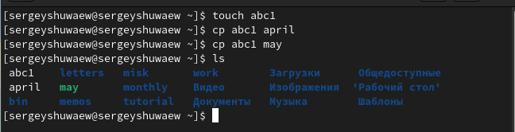

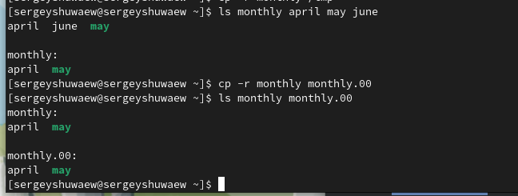

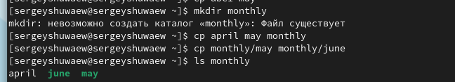

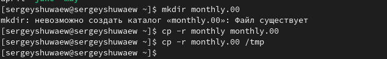

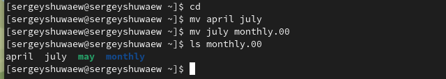

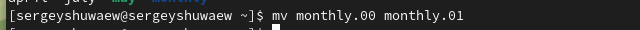

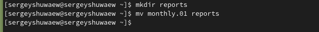

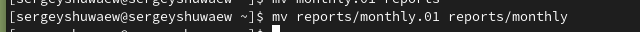

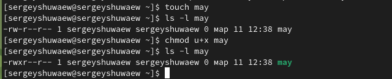{#fig:001 width=70%}

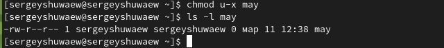

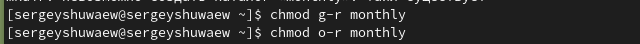

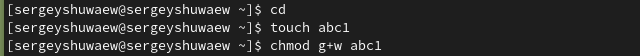

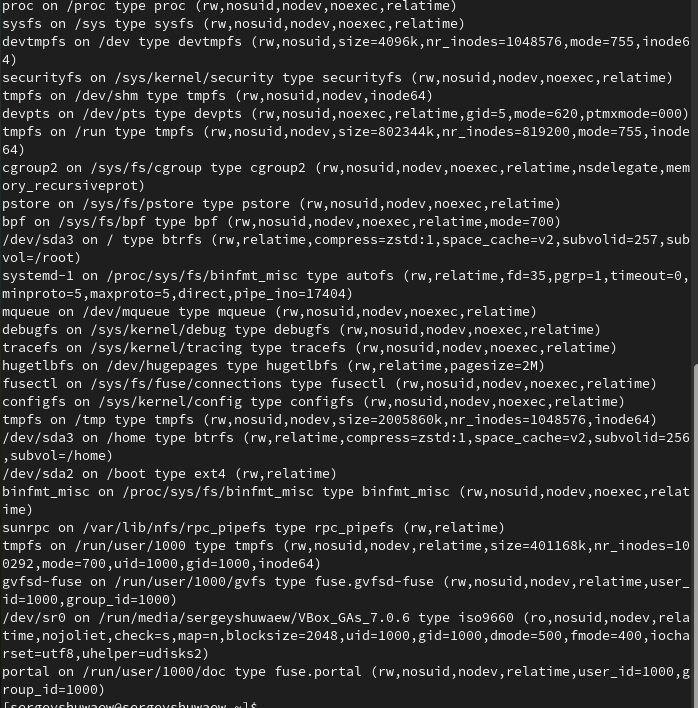

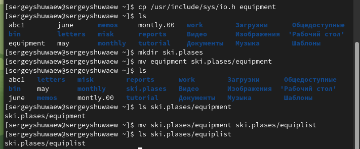{#fig:001 width=70%}

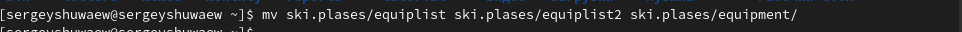

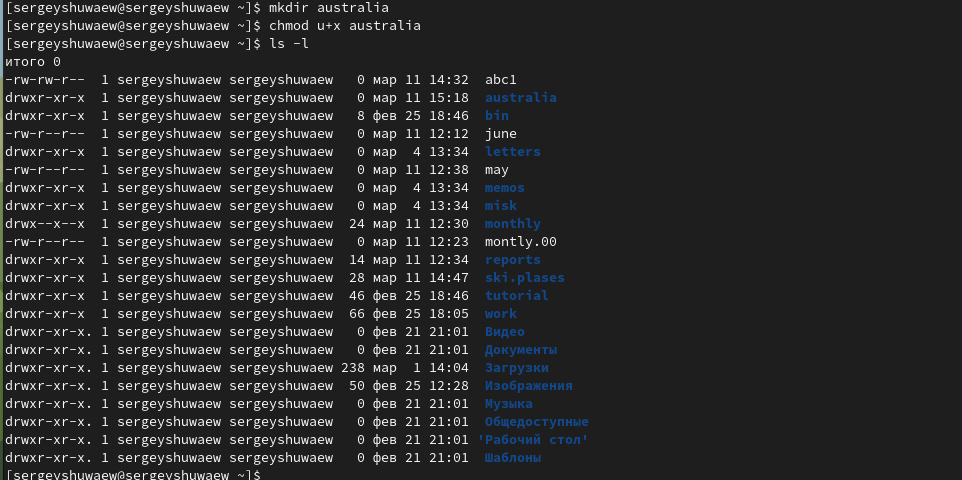

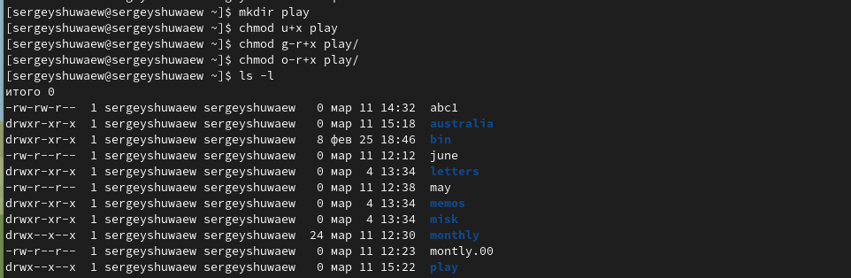

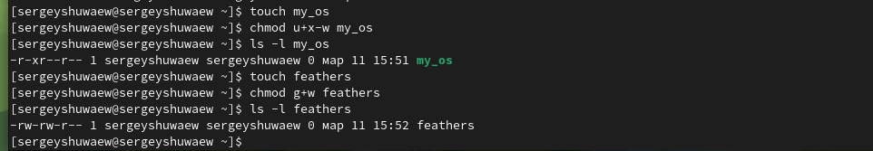

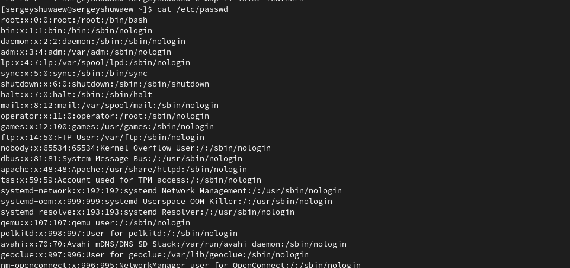

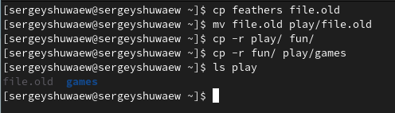

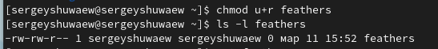

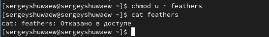

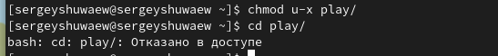{#fig:001 width=70%}

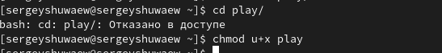

## Прочитать документацию о командах mount, fsck, mkfs, kill

mount — утилита командной строки в UNIX-подобных операционных системах. Применяется для монтирования файловых систем.

fsck (проверка файловой системы) - это утилита командной строки, которая позволяет выполнять проверки согласованности и интерактивное исправление в одной или нескольких файловых системах Linux. Он использует программы, специфичные для типа файловой системы, которую он проверяет.

mkfs используется для создания файловой системы Linux на некотором устройстве, обычно в разделе жёсткого диска. В качестве аргумента filesys для файловой системы может выступать или название устройства

Команда Kill посылает указанный сигнал указанному процессу. Если не указано ни одного сигнала, посылается сигнал SIGTERM. Сигнал SIGTERM завершает лишь те процессы, которые не обрабатывают его приход. Для других процессов может быть необходимым послать сигнал SIGKILL, поскольку этот сигнал перехватить невозможно.

## Выводы

При выполнении данной лабораторной работы я ознакомился с файловой системой Linux, её структурой, именами и содержанием каталогов. Приобрел практические навыки по применению команд для работы с файлами и каталогами, по управлению процессами (и работами), по проверке использования диска и обслуживанию файловой системы

## Спасибо за внимание
:::

