---
## Front matter
lang: ru-RU
title: Лабораторная работа №7
subtitle: Операционные системы
author:
  - Шуваев Сергей Александрович.
institute:
  - Российский университет дружбы народов, Москва, Россия

date: 15 марта 2023

## i18n babel
babel-lang: russian
babel-otherlangs: english

## Formatting pdf
toc: false
toc-title: Содержание
slide_level: 2
aspectratio: 169
section-titles: true
theme: metropolis
header-includes:
 - \metroset{progressbar=frametitle,sectionpage=progressbar,numbering=fraction}
 - '\makeatletter'
 - '\beamer@ignorenonframefalse'
 - '\makeatother'
---

## Докладчик

:::::::::::::: {.columns align=center}
::: {.column width="70%"}

  * Шуваев Сергей Александрович.
  * студент из группы НКАбд-05-22
  * Факультет физико-математических и естественных наук
  * Российский университет дружбы народов
  * [1032224269@pfur.ru](grinders060050@mail.ru)
  * <https://github.com/Grinders060050/Grinders060050.github.io>

:::
::: {.column width="30%"}

:::
::::::::::::::

## Цель работы

 Цель данной лабораторной работы - ознакомление с инструментами поиска файлов и фильтрации текстовых данных, а также приобретение практических навыков по управлению процессами (и заданиями), по проверке использования диска и по обслуживанию файловых систем.

## Выполнение лабораторной работы

 вошел в систему под соотвествующим именем пользователя, открыл терминал.

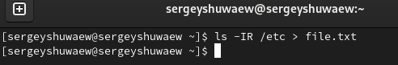

## Выполнение лабораторной работы

 записал в файл file.txt названия файлов из каталога /etc с помощью перенаправления ">" (и файл создал, и записал в него то, что могло быть выведено ls -lR /etc). В файл я добавил также все файлы из подкаталогов .

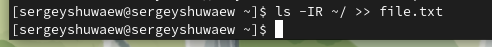

## Выполнение лабораторной работы

 Вывел на экран имена всех файлов, имеющих расширение ".conf" с помощью утилиты grep.

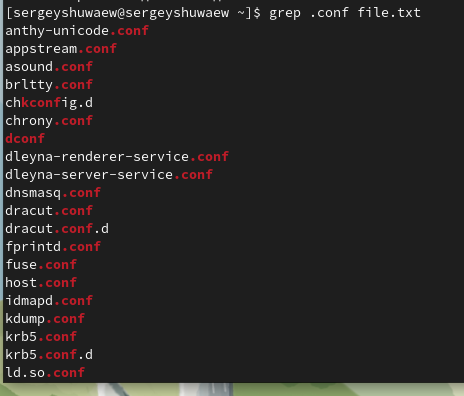

## Выполнение лабораторной работы

 Определяю,какие файлы в домашнем каталоге начинаютя с символа "c" с помощью утилиты find, прописываю ей в аргументах домашнюю директорию (тогда вывод относительно корневого каталога, а не домашнего будет), выбираю опцию -name (ищем по имени), и пишу маску, по которой будем искать имя, где * - любое кол-во любых символов, добавляю опцию -print, чтобы мне вывелся результат ,

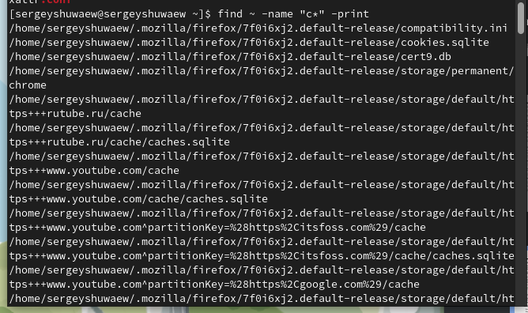

## Выполнение лабораторной работы

 Второй способ использовать утилиту ls -lR и использовать grep, чтобы найти элементы с первым символом c. Однако этот способ не работает для поиска файлов из подкаталогов каталога .

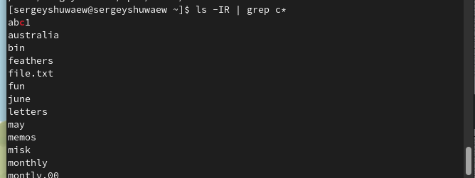.

## Выполнение лабораторной работы

 С помощью метода find, чьи опции я расписала ранее, ищу все файлы, начинающиеся с буквы "h",

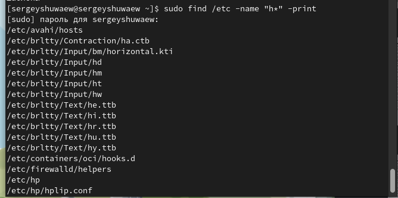

## Выполнение лабораторной работы

 Запускаю в фоновом режиме (на это указывает символ &) процесс, который будет записывать в файл logfile (с помощью перенаправления >) файлы, имена которых начинаются с log 

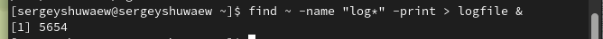

## Выполнение лабораторной работы

 Проверяю, что файл создан, удаляю его, проверяю, что файл удален

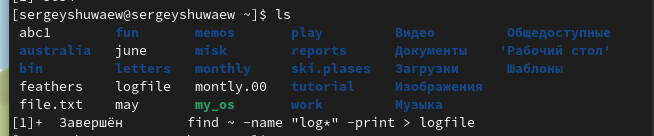

## Выполнение лабораторной работы

 Проверяю, что файл создан, удаляю его, проверяю, что файл удален

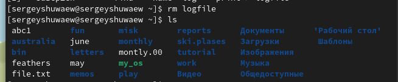

## Выполнение лабораторной работы

 Запускаю в консоли в фоновом режиме (с помощью символа &) редактор gedit

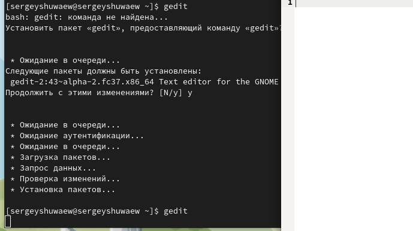

## Выполнение лабораторной работы

 С помощью утилиты ps определяю идентификатор процесса gedit его идентификатор 6619

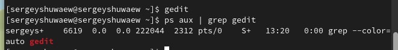

## Выполнение лабораторной работы

 Также мы можем определить идентификатор с помощью pgrep.

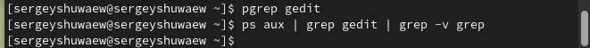

## Выполнение лабораторной работы

 Прочитал документацию про функции df и du

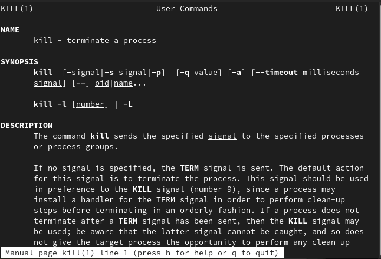

## Выполнение лабораторной работы

 Прочитал документацию про функции df и du

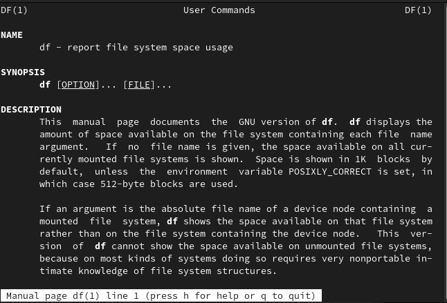

## Выполнение лабораторной работы

 Прочитал документацию про функции df и du

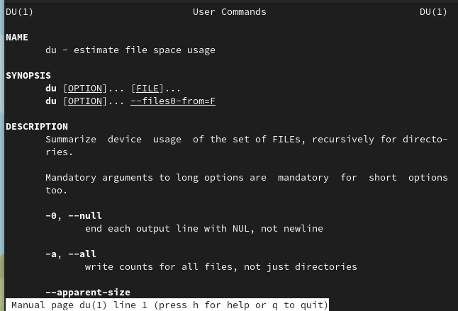

## Выполнение лабораторной работы

 Использую утилиту df опции -iv позволяют увидеть информацию об инодах и сделать вывод читаемым, игнорируя сообщения системы о нем. Эта утилита нам нужна, чтобы выяснить, сколько свободного места есть у нашей системы.,

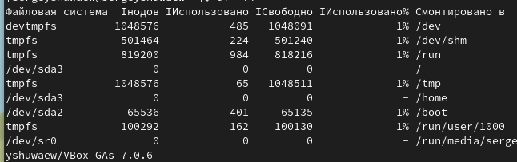

## Выполнение лабораторной работы

 Вывел имена всех директорий, имеющихся в моем домашнем каталоге, используя аргумент d у утилиты find опции -type, то есть указываю тип файлов, который мне нужен и этот тип Директория . Утилита -а позволит увидеть размер всех файлов, а не только директорий.

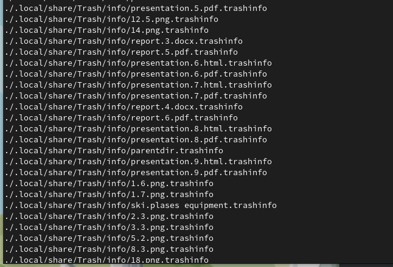

# Выводы

В результате данной лабораторной работы я ознакомился с инструментами поиска файлов и фильтрации текстовых данных, а также приобрел практические навыки по управлению процессами (и заданиями), по проверке использования диска и по обслуживанию файловых систем.

## Спасибо за внимание
