---
## Front matter
lang: ru-RU
title: Лабораторная работа №7
subtitle: Операционные системы
author:
  - Шуваев Сергей Александрович.
institute:
  - Российский университет дружбы народов, Москва, Россия

date: 15 марта 2023

## i18n babel
babel-lang: russian
babel-otherlangs: english

## Formatting pdf
toc: false
toc-title: Содержание
slide_level: 2
aspectratio: 169
section-titles: true
theme: metropolis
header-includes:
 - \metroset{progressbar=frametitle,sectionpage=progressbar,numbering=fraction}
 - '\makeatletter'
 - '\beamer@ignorenonframefalse'
 - '\makeatother'
---

## Докладчик

:::::::::::::: {.columns align=center}
::: {.column width="70%"}

  * Шуваев Сергей Александрович.
  * студент из группы НКАбд-05-22
  * Факультет физико-математических и естественных наук
  * Российский университет дружбы народов
  * [1032224269@pfur.ru](grinders060050@mail.ru)
  * <https://github.com/Grinders060050/Grinders060050.github.io>

:::
::: {.column width="30%"}

:::
::::::::::::::

## Цель работы

 Цель данной лабораторной работы - освоение основных возможностей командной оболочки Midnight Commander, приобретение навыков практической работы по просмотру каталогов и файлов; манипуляций с ними

## Выполнение лабораторной работы

 С помощью команды man mc прочитал документацию про командную оболочку.

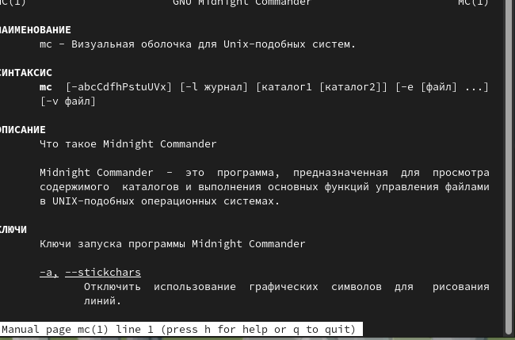

## Выполнение лабораторной работы

 Ввожу в терминале mc и получаю окно, в котором далее смогу работать

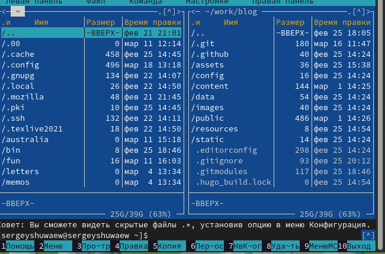

## Выполнение лабораторной работы

 помощью стрелочек влево вправо я могу перемещаться по директориям, а с помощью стрелочек вверх вниз перебирать файлы в директории, в которой нахожусь

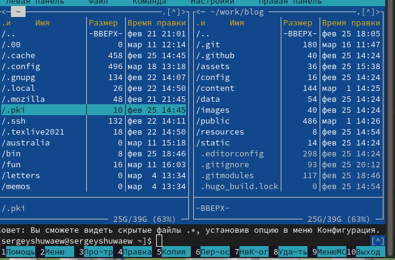

## Выполнение лабораторной работы

 С помощью F5 могу создать копию файла в выбранном каталоге

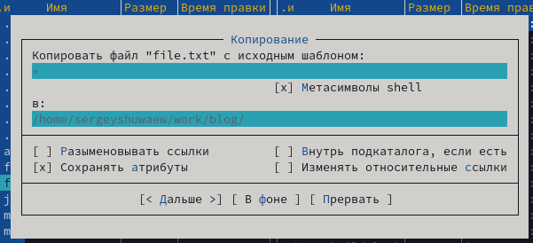

## Выполнение лабораторной работы

 С помощью управляющих клавиш так же можно получить информациб о правах доступа на файл и информацию о нем

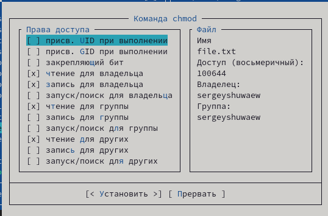.

## Выполнение лабораторной работы

 В меню правой панели вывел информацию о файле, получаю информации больше чем в выводе ls -l

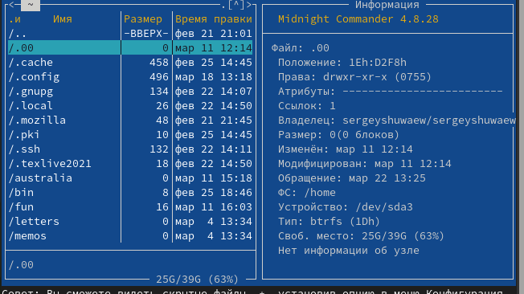

## Выполнение лабораторной работы

 Используя возможности подменю "Файл" я просмотрел содержимое текстового файла 

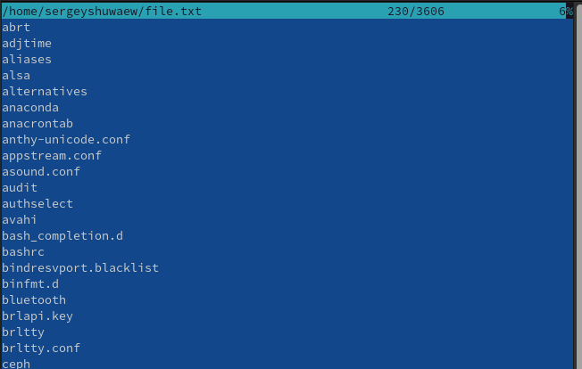

## Выполнение лабораторной работы

Открыл файл на изменение, поменял пару строк и закрыл файл без сохранения 

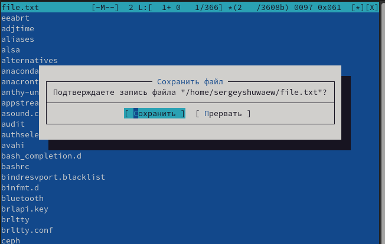

## Выполнение лабораторной работы

 Создаю каталог family

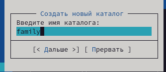

## Выполнение лабораторной работы

 Копирую файл в созданный каталог (рис. @fig:010). Действия выше можно было сделать с помощью горячих клавиш.

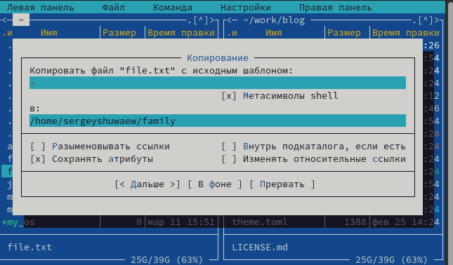

## Выполнение лабораторной работы

 С помощью средств подменю Команда можно найти файл с заданным условием, я искал файлы формата .txt 

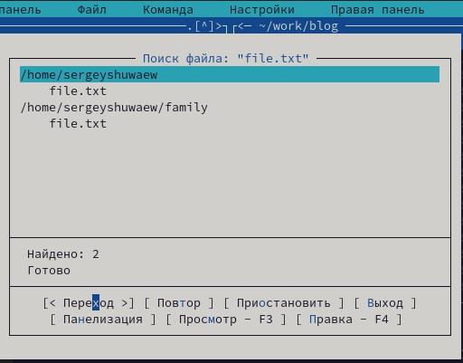

## Выполнение лабораторной работы

 Можно перемещаться между директориями, я перемещусь в домашнюю
 
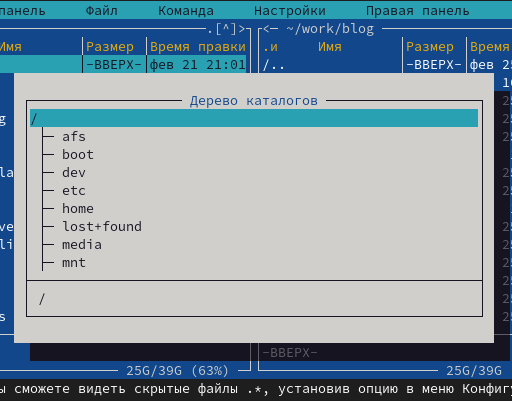

## Выполнение лабораторной работы

 Анализирую файл меню

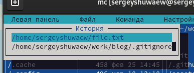

## Выполнение лабораторной работы

 Из подменю настройки вызвал окна настройки панели (рис. @fig:016), настройки внешнего вида (рис. @fig:017), настройки распознавания клавиш (рис. @fig:018), параметры конфигурации (рис. @fig:019).

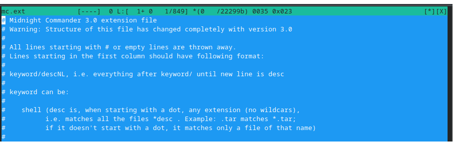

## Выполнение лабораторной работы

 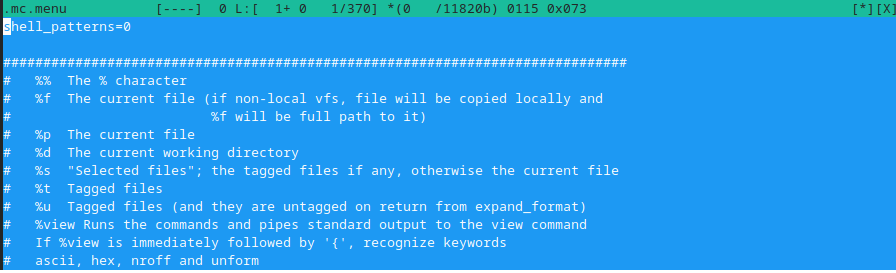

## Выполнение лабораторной работы

 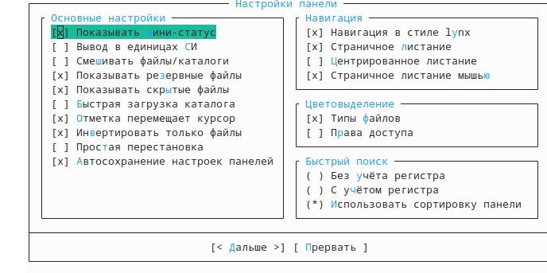

## Выполнение лабораторной работы

 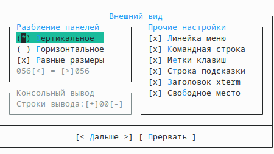

## Выполнение лабораторной работы

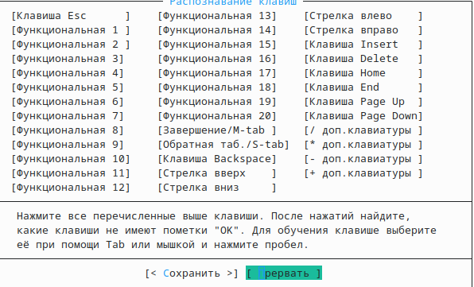

## Выполнение лабораторной работы

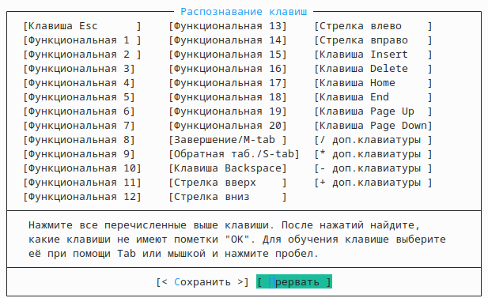

## Выполнение лабораторной работы

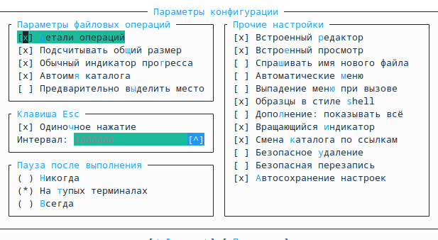{#fig:001 width=70%}

## Выполнение лабораторной работы

Командой touch text.txt создал файл

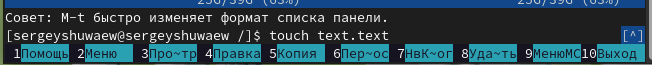{#fig:001 width=70%}

## Выполнение лабораторной работы

Клавишей F4 открыл файл для записи, добавил в него текст

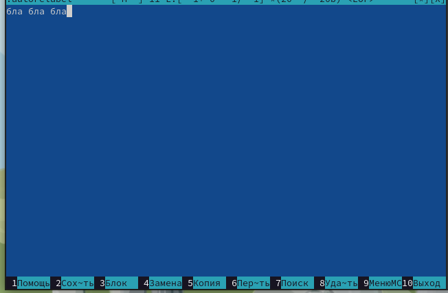{#fig:001 width=70%}

## Выполнение лабораторной работы

Выделяю текст с помощью клавиши F3 и кликов мышью

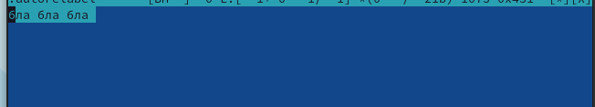{#fig:001 width=70%}

## Выполнение лабораторной работы

Удалил строку текста с помощью ctrl+y 

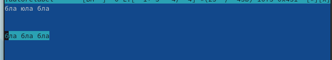{#fig:001 width=70%}

## Выполнение лабораторной работы

Сохраняю изменения в файле с помощью горячей клавиши F2

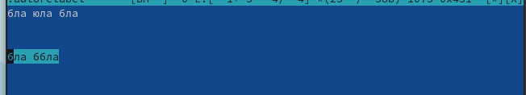{#fig:001 width=70%}

## Выполнение лабораторной работы

С помощью ctrl+u отменяю последнее действие и возвращаю удаленную строку

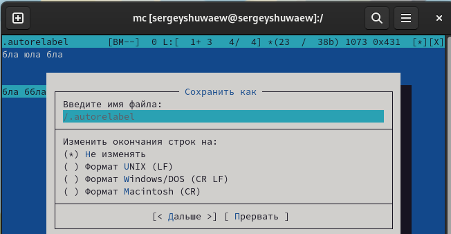{#fig:001 width=70%}

## Выполнение лабораторной работы

С помощью клавиш pgup pgdn у меня получилось попасть в начало и в конец файла соответственно, я добавил текст в начало и в конец файла

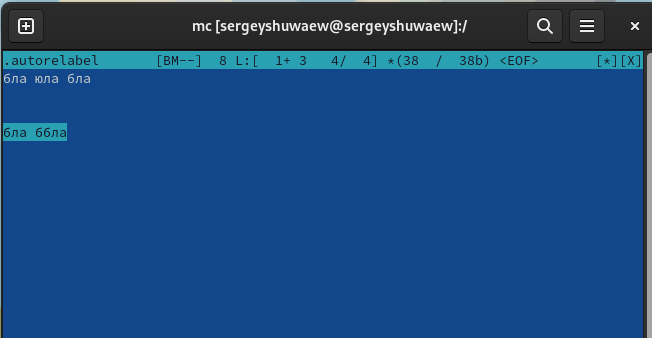{#fig:001 width=70%}

## Выполнение лабораторной работы

Горячая клавиша F10 закрывает файл, дополнительно спрашивая сохранить ли в нем несохраненные изменения, сохраняю и закрываю 

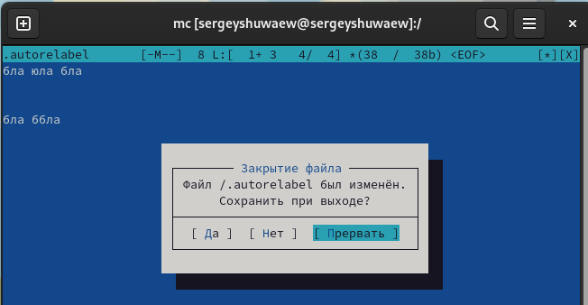{#fig:001 width=70%}

## Выполнение лабораторной работы

Открываю файл формата .cpp, с кодом на С++, встроенный редактор mc вывел его содержимое с подсветкой 

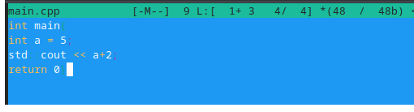{#fig:001 width=70%}

## Выполнение лабораторной работы

Я отключил подсветку и вывел снова тот же самый файл, но уже без подсветки

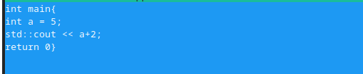{#fig:001 width=70%}

# Выводы

При выполнениии данной лабораторной работы я освоил основные возможности командной оболочки Midnight Commander, приобрел навыки практической работы по просмотру каталогов и файлов; манипуляций с ними

# Ответы на контрольные вопросы

Какие режимы работы есть в mc. Охарактеризуйте их. Панели могут дополнительно быть переведены в один из двух режимов: Информация или Дерево. В режиме Информация на панель выводятся сведения о файле и текущей файловой системе, расположенных на активной панели. В режиме Дерево (рис. 7.3) на одной из панелей выводится структура дерева каталогов.
Какие операции с файлами можно выполнить как с помощью команд shell, так и с помощью меню (комбинаций клавиш) mc? Приведите несколько примеров. В разделе Командная строка оболочки (Shell) перечисляются команды и комбинации клавиш, которые используются для ввода и редактирования команд в командной строке оболочки. Большая часть этих команд служит для переноса имен файлов и/или имен каталогов в командную строку (чтобы уменьшить трудоемкость ввода) или для доступа к истории команд. Клавиши редактирования строк ввода используются как при редактировании командной строки, так и других строк ввода, появляющихся в различных запросах программы.
Как с помощью меню так и с помощью команд shell можно переносить, копировать и получать информацию о файоах и каталогах.
Опишите структура меню левой (или правой) панели mc, дайте характеристику командам.
В меню каждой (левой или правой) панели можно выбрать Формат списка:
стандартный — выводит список файлов и каталогов с указанием размера и времени правки;
ускоренный — позволяет задать число столбцов, на которые разбивается панель при выводе списка имён файлов или каталогов без дополнительной информации;
расширенный — помимо названия файла или каталога выводит сведения о правах доступа, владельце, группе, размере, времени правки;
определённый пользователем — позволяет вывести те сведения о файле или каталоге, которые задаст сам пользователь.
Опишите структура меню Файл mc, дайте характеристику командам. В меню Файл содержит перечень команд, которые могут быть применены к одному или нескольким файлам или каталогам.
Команды меню Файл:
Просмотр ( F3 ) — позволяет посмотреть содержимое текущего (или выделенного) файла без возможности редактирования.
Просмотр вывода команды ( М + ! ) — функция запроса команды с параметрами (аргумент к текущему выбранному файлу).
Правка ( F4 ) — открывает текущий (или выделенный) файл для его редактирования.
Копирование ( F5 ) — осуществляет копирование одного или нескольких файлов или каталогов в указанное пользователем во всплывающем окне место.
Права доступа ( Ctrl-x c ) — позволяет указать (изменить) права доступа к одному или нескольким файлам или каталогам .
Жёсткая ссылка ( Ctrl-x l ) — позволяет создать жёсткую ссылку к текущему (или выделенному) файлу.
Символическая ссылка ( Ctrl-x s ) — позволяет создать символическую ссылку к текущему (или выделенному) файлу.
Владелец/группа ( Ctrl-x o ) — позволяет задать (изменить) владельца и имя группы для одного или нескольких файлов или каталогов.
Права (расширенные) — позволяет изменить права доступа и владения для одного или нескольких файлов или каталогов.
Переименование ( F6 ) — позволяет переименовать (или переместить) один или несколько файлов или каталогов.
Создание каталога ( F7 ) — позволяет создать каталог.
Удалить ( F8 ) — позволяет удалить один или несколько файлов или каталогов.
Выход ( F10 ) — завершает работу mc.
Опишите структура меню Команда mc, дайте характеристику командам.
В меню Команда содержатся более общие команды для работы с mc. Команды меню Команда:
Дерево каталогов — отображает структуру каталогов системы.
Поиск файла — выполняет поиск файлов по заданным параметрам.
Переставить панели — меняет местами левую и правую панели.
Сравнить каталоги ( Ctrl-x d ) — сравнивает содержимое двух каталогов.
Размеры каталогов — отображает размер и время изменения каталога (по умолчанию в mc размер - каталога корректно не отображается).
История командной строки — выводит на экран список ранее выполненных в оболочке команд.
Каталоги быстрого доступа ( Ctrl-\ ) — пр вызове выполняется быстрая смена текущего каталога на один из заданного списка.
Восстановление файлов — позволяет восстановить файлы на файловых системах ext2 и ext3.
Редактировать файл расширений — позволяет задать с помощью определённого синтаксиса действия при запуске файлов с определённым расширением (например, какое программного обеспечение запускать для открытия или редактирования файлов с расширением doc или docx).
Редактировать файл меню — позволяет отредактировать контекстное меню пользователя, вызываемое по клавише F2 .
Редактировать файл расцветки имён — позволяет подобрать оптимальную для пользователя расцветку имён файлов в зависимости от их типа.
Опишите структура меню Настройки mc, дайте характеристику командам.
Меню Настройки содержит ряд дополнительных опций по внешнему виду и функциональности mc. Меню Настройки содержит:
Конфигурация — позволяет скорректировать настройки работы с панелями.
Внешний вид и Настройки панелей — определяет элементы (строка меню, командная строка, подсказки и прочее), отображаемые при вызове mc, а также геометрию расположения панелей и цветовыделение.
Биты символов — задаёт формат обработки информации локальным терминалом.
Подтверждение — позволяет установить или убрать вывод окна с запросом подтверждения действий при операциях удаления и перезаписи файлов, а также при выходе из программы.
Распознание клавиш — диалоговое окно используется для тестирования функциональных клавиш, клавиш управления курсором и прочее.
Виртуальные ФС –– настройки виртуальной файловой системы: тайм-аут, пароль и прочее.
Назовите и дайте характеристику встроенным командам mc.
F1 Вызов контекстно-зависимой подсказки;
F2 Вызов пользовательского меню с возможностью создания и/или дополнения дополнительных функций;
F3 Просмотр содержимого файла, на который указывает подсветка в активной панели (без возможности редактирования);
F4 Вызов встроенного в mc редактора для изменения содержания файла, на который указывает подсветка в активной панели;
F5 Копирование одного или нескольких файлов, отмеченных в первой (активной) панели, в каталог, отображаемый на второй панели;
F6 Перенос одного или нескольких файлов, отмеченных в первой (активной) панели, в каталог, отображаемый на второй панели;
F7 Создание подкаталога в каталоге, отображаемом в активной панели;
F8 Удаление одного или нескольких файлов (каталогов), отмеченных в первой (активной) панели файлов;
F9 Вызов меню mc;
F10 Выход из mc;
Назовите и дайте характеристику командам встроенного редактора mc.
Ctrl-y удалить строку;
Ctrl-u отмена последней операции; Ins вставка/замена;
F7 поиск (можно использовать регулярные выражения);
(стрелочка вверх)-F7 повтор последней операции поиска;
F4 замена;
F3 первое нажатие — начало выделения,
второе — окончание выделения;
F5 копировать выделенный фрагмент;
F6 переместить выделенный фрагмент;
F8 удалить выделенный фрагмент;
F2 записать изменения в файл;
F10 выйти из редактора.
Дайте характеристику средствам mc, которые позволяют создавать меню, определяемые пользователем.
Можете сохранить часто используемые команды панелизации под отдельными информативными именами, чтобы иметь возможность их быстро вызвать по этим именам. Для этого нужно набрать команду в строке ввода (строка "Команда") и нажать кнопку Добавить. После этого потребуется ввести имя, по которому мы будем вызывать команду. В следующий раз вам достаточно будет выбрать нужное имя из списка, а не вводить всю команду заново.
Дайте характеристику средствам mc, которые позволяют выполнять действия, определяемые пользователем, над текущим файлом.
Панель в mc отображает список файлов текущего каталога. Абсолютный путь к этому каталогу отображается в заголовке панели. У активной панели заголовок и одна из её строк подсвечиваются. Управление панелями осуществляется с помощью определённых комбинаций клавиш или пунктов меню mc.

## Спасибо за внимание
