---
## Front matter
lang: ru-RU
title: Лабораторная работа №8
subtitle: Операционные системы
author:
  - Шуваев Сергей Александрович.
institute:
  - Российский университет дружбы народов, Москва, Россия

date: 29 марта 2023

## i18n babel
babel-lang: russian
babel-otherlangs: english

## Formatting pdf
toc: false
toc-title: Содержание
slide_level: 2
aspectratio: 169
section-titles: true
theme: metropolis
header-includes:
 - \metroset{progressbar=frametitle,sectionpage=progressbar,numbering=fraction}
 - '\makeatletter'
 - '\beamer@ignorenonframefalse'
 - '\makeatother'
---

## Докладчик

:::::::::::::: {.columns align=center}
::: {.column width="70%"}

  * Шуваев Сергей Александрович.
  * студент из группы НКАбд-05-22
  * Факультет физико-математических и естественных наук
  * Российский университет дружбы народов
  * [1032224269@pfur.ru](grinders060050@mail.ru)
  * <https://github.com/Grinders060050/Grinders060050.github.io>

:::
::: {.column width="30%"}

:::
::::::::::::::

## Цель работы

Цель данной лабораторной работы - познакомиться с операционной системой Linux, получить практические навыки работы с редактором vi, установленным по умолчанию практически во всех дистрибутивах.

## Выполнение лабораторной работы

 Создаю директорию, в которой буду работать, с помощью команды mkdir, перехожу в нее с помощью команды cd, создаю и открываю для редактирования файл с помощью встроенного текстового редактора vi

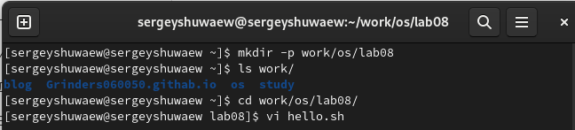

## Выполнение лабораторной работы

 Нажимаю i, чтобы начать редактирование и добавляться текст (режим добавления), далее добавляю текст.

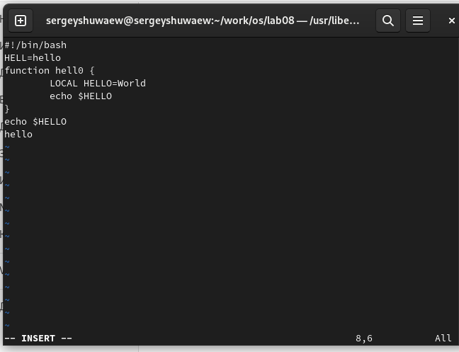

## Выполнение лабораторной работы

 Нажимаю esc, чтобы выйти из режима добавления и перейти в командный режим. Перехожу в режим последней строки.

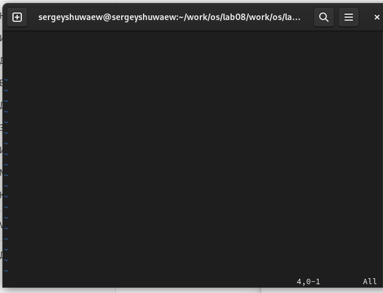

## Выполнение лабораторной работы

 Ввожу w для сохранения и q для выхода и нажимаю enter, после чего файл сохраняется с изменениями и я возвращаюсь в терминал. 

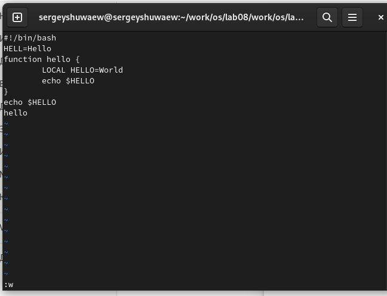

## Выполнение лабораторной работы

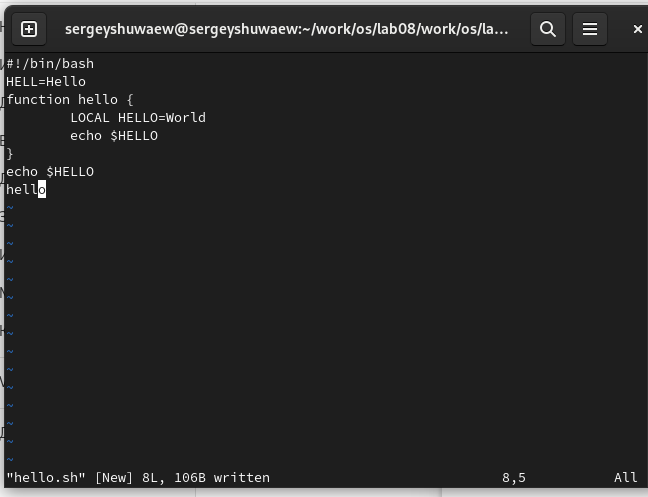. 

## Выполнение лабораторной работы

 

## Выполнение лабораторной работы

 С помощью chmod добавляю права на исполнение файла, делая его исполняемым. 

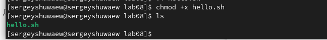

## Выполнение лабораторной работы

 Снова открываю этот файл с помощью текстового редактора vi.

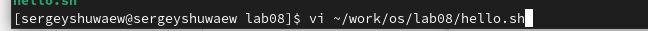

## Выполнение лабораторной работы

 В режиме добавления (клавиша i) удаляю слово LOCAL, снова перехожу в командный режим с помощью esc.

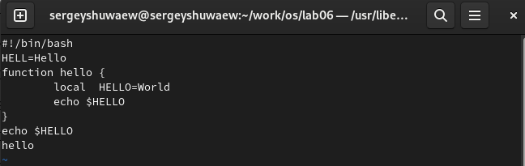

## Выполнение лабораторной работы

 В режиме добавления (клавиша i) добавляю слово local, снова перехожу в командный режим с помощью esc

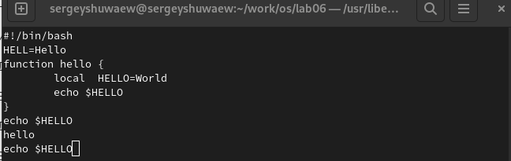

## Выполнение лабораторной работы

 В режиме добавления (клавиша i) перехожу в конец последней строки и добавляю новую строку, снова перехожу в командный режим с помощью esc. После этого я вернулся в режим добавления, удалил строку и вернулся в командный режим. 

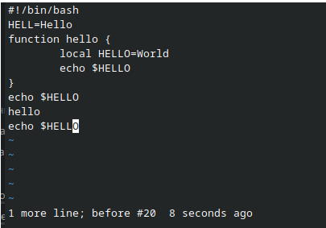

## Выполнение лабораторной работы

 В командном режиме я нажал "u" и отменила последнее действие, удаление строки
 
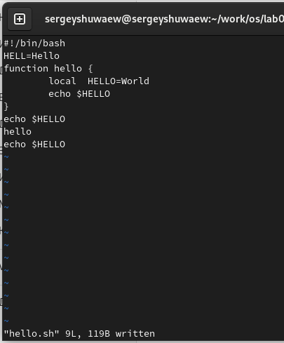

## Выполнение лабораторной работы

 Перешел в режим последней строки и ввел w для сохранения файла и q для выхода, нажал enter и файл закрылся.

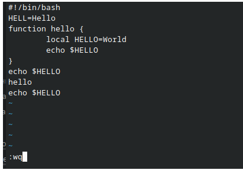

#Выводы

При выполнении данной лабораторной работы я познакомился с операционной системой Linux, получил практические навыки работы с редактором vi, установленным по умолчанию практически во всех дистрибьютивах

## Спасибо за внимание
