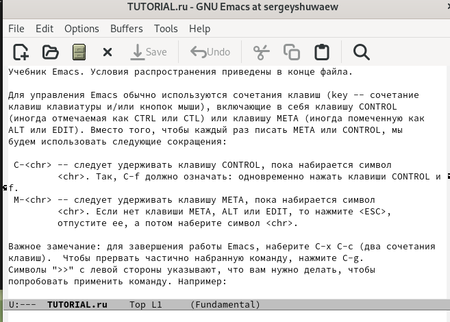

---
## Front matter
lang: ru-RU
title: Лабораторная работа №9
subtitle: Операционные системы
author:
  - Шуваев Сергей Александрович.
institute:
  - Российский университет дружбы народов, Москва, Россия

date: 29 марта 2023

## i18n babel
babel-lang: russian
babel-otherlangs: english

## Formatting pdf
toc: false
toc-title: Содержание
slide_level: 2
aspectratio: 169
section-titles: true
theme: metropolis
header-includes:
 - \metroset{progressbar=frametitle,sectionpage=progressbar,numbering=fraction}
 - '\makeatletter'
 - '\beamer@ignorenonframefalse'
 - '\makeatother'
---

# Информация

## Докладчик

:::::::::::::: {.columns align=center}
::: {.column width="70%"}

  * Шуваев Сергей Александрович.
  * студент из группы НКАбд-05-22
  * Факультет физико-математических и естественных наук
  * Российский университет дружбы народов
  * [1032224269@pfur.ru](grinders060050@mail.ru)
  * <https://github.com/Grinders060050/Grinders060050.github.io>

:::
::: {.column width="30%"}

:::
::::::::::::::

## Цель работы

Цель данной лабораторной работы - познакомиться с операционной системой Linux. Получить практические навыки работы с редактором Emacs.

## Выполнение лабораторной работы

 Прописываю в файле текст программы
 

## Выполнение лабораторной работы

 Сохраняю файл с помощью комбинации C-x C-s

## Выполнение лабораторной работы

 Вырезаю одной командой целую строку (С-k)

## Выполнение лабораторной работы

 Вставляю эту строку в конец файла (C-y) 

## Выполнение лабораторной работы

Выделяю область текста (C-space), копирую область в буфер обмена (M-w), вырезаю эту область с помощью C-w

. 

## Выполнение лабораторной работы

Вставляю область в конец файла (С-у)

 

## Выполнение лабораторной работы

 Отменяю последнее действие С-/

## Выполнение лабораторной работы

 Перевожу курсор в начало строки С-а
 

## Выполнение лабораторной работы

 Перемещаю курсор в конец строки С-е

## Выполнение лабораторной работы

 Перемещаю курсор в начало файла М-<

## Выполнение лабораторной работы

Перемещаю курсор в конец файла M->

## Выполнение лабораторной работы

 Открываю список активных буферов в другом окне C-x C-b
 

## Выполнение лабораторной работы

 Переключаюсь на другой буфер C-x o

## Выполнение лабораторной работы

Закрываю окно другого буфера C-x 0

## Выполнение лабораторной работы

Открываю другой буфер без вывода их списка на экран с помощью C-x b

## Выполнение лабораторной работы

Делю фрейм на 4 части: сначала на два окна по вертикали (C-x 3), а затем каждое из этих окон на две части по горизонтали (C-x 2) 

## Выполнение лабораторной работы

В каждом из четырех созданных окон с помощью C-x b открыла разные буферы

## Выполнение лабораторной работы

Перехожу в режим поиска с помощью C-s, ищу слова в тексте, они подсвечиваются 

## Выполнение лабораторной работы

С помощью той же комбинации C-s я могу перемещаться по результатам поиска 

## Выполнение лабораторной работы

С помощью C-g выхожу из режима поиска, снимается выделение

## Выполнение лабораторной работы

Перехожу в режим поиска и замены с помощью M-%, ввожу какое слово хочу заменить, затем ввожу на какое хочу заменить

## Выполнение лабораторной работы

Видим, что слова были заменены успешно

## Выполнение лабораторной работы

## Выполнение лабораторной работы

С помощью M+s перехожу в другой режим поиска. Он отличается от предыдущего тем, что выводит результат в отдельном окне от окна буфера

#Выводы

В ходе данной лабороторной работы я познакомился с операционной системой Linuх, получил практические навыки работы с редактором Emacs.

## Спасибо за внимание
