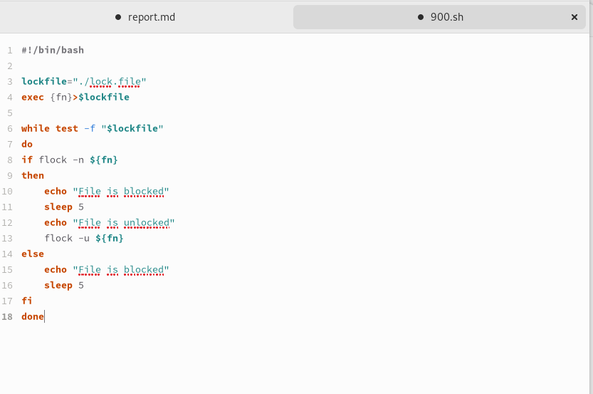
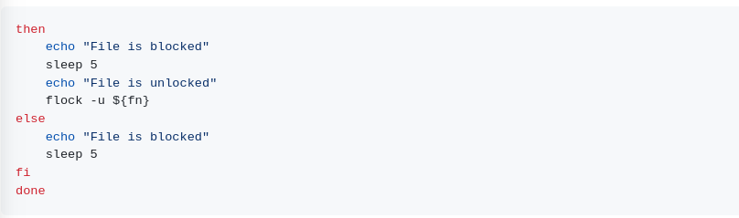
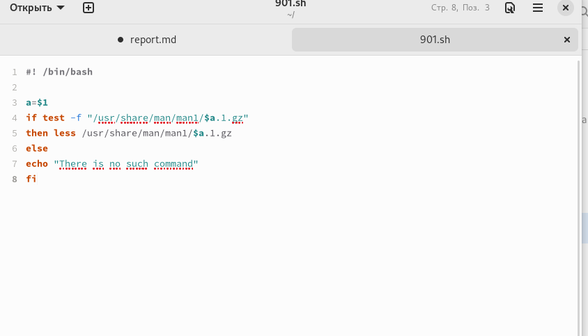
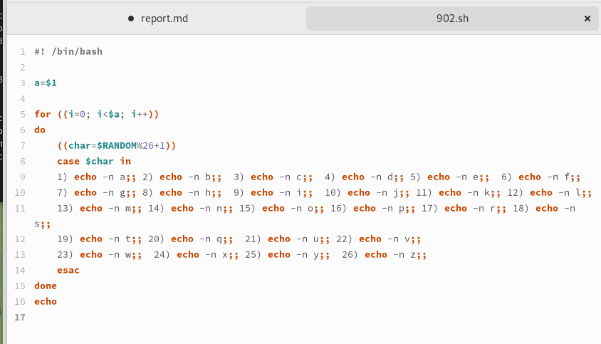

---
## Front matter
lang: ru-RU
title: Лабораторная работа №12
subtitle: Операционные системы
author:
  - Шуваев Сергей Александрович.
institute:
  - Российский университет дружбы народов, Москва, Россия

date: 11 июля 1985 года

## i18n babel
babel-lang: russian
babel-otherlangs: english

## Formatting pdf
toc: false
toc-title: Содержание
slide_level: 2
aspectratio: 169
section-titles: true
theme: metropolis
header-includes:
 - \metroset{progressbar=frametitle,sectionpage=progressbar,numbering=fraction}
 - '\makeatletter'
 - '\beamer@ignorenonframefalse'
 - '\makeatother'
---

# Информация

## Докладчик

:::::::::::::: {.columns align=center}
::: {.column width="70%"}

  * Шуваев Сергей Александрович.
  * студент из группы НКАбд-05-22
  * Факультет физико-математических и естественных наук
  * Российский университет дружбы народов
  * [1032224269@pfur.ru](grinders060050@mail.ru)
  * <https://github.com/Grinders060050/Grinders060050.github.io>

:::
::: {.column width="30%"}

:::
::::::::::::::

# Цель работы

Цель данной лабораторной работы - изучить основы программирования в оболочке ОС UNIX, научится писать более сложные командные файлы с использованием логических управляющих конструкций и циклов.

# Программа №1

1. Используя команды getopts grep, написать командный файл, который анализирует командную строку с ключами:
- iinputfile — прочитать данные из указанного файла;
- ooutputfile — вывести данные в указанный файл;
- p шаблон — указать шаблон для поиска;
- C — различать большие и малые буквы;
- n — выдавать номера строк. а затем ищет в указанном файле нужные строки, определяемые ключом -p.

# Код программы 1

## Программа 2

## Программа 3

## Программа 4

# Выводы

При выполнении данной лабораторной работы я изучил основы программирования в оболочке ОС UNIX, научился  писать более сложные командные файлы с использованием логических управляющих конструкций и циклов.

## Спасибо за внимание

