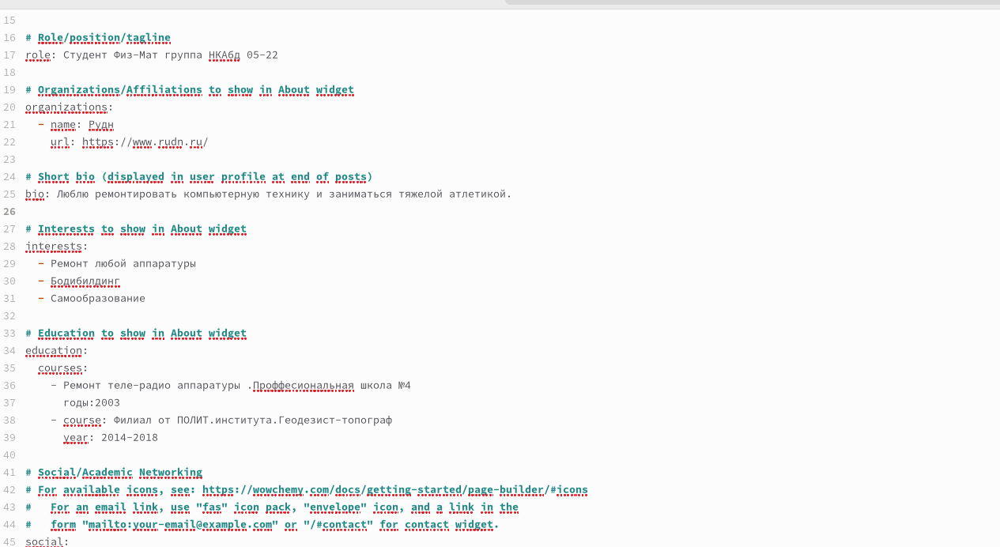
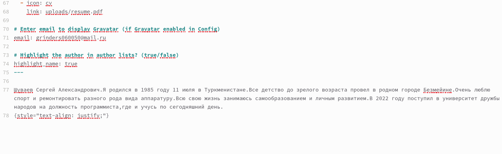
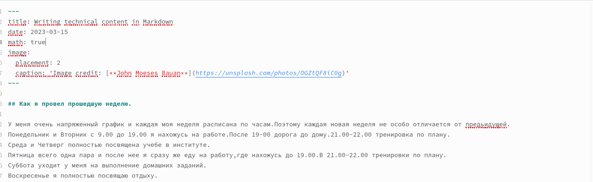
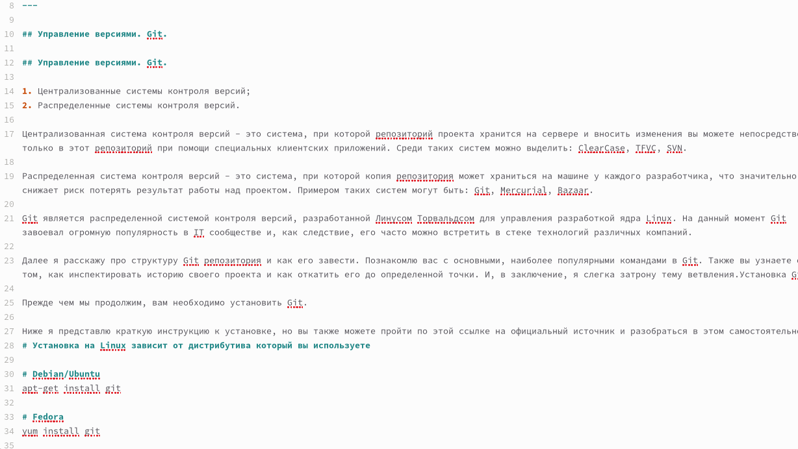

---
## Front matter
lang: ru-RU
title: Отчёт по второму этапу индивидуального проекта
subtitle: "Добавление информации о себе"
author:
  - "Шуваев Сергей Александрович"
institute:
  - Российский университет дружбы народов, Москва, Россия
 
date: 11 07  1985

## i18n babel
babel-lang: russian
babel-otherlangs: english

## Formatting pdf
toc: false
toc-title: Содержание
slide_level: 2
aspectratio: 169
section-titles: true
theme: metropolis
header-includes:
 - \metroset{progressbar=frametitle,sectionpage=progressbar,numbering=fraction}
 - '\makeatletter'
 - '\beamer@ignorenonframefalse'
 - '\makeatother'
---

# Информация

## Докладчик

:::::::::::::: {.columns align=center}
::: {.column width="70%"}

  * Шуваев Сергей Александрович
  * Студент 1-го курса направление Фундаментальная информатика
  * Российский университет дружбы народов
  * [1032224269@pfur.ru](grinders060050@mail.ru)
  * <https://github.com/Grinders060050/Grinders060050.github.io>

:::
::: {.column width="30%"}

:::
::::::::::::::

## Цели и задачи

- Научиться добавлять данные к сайту, созданном на Hugo. Научиться добавлять и редактировать посты.

## Цели и задачи

- Разместить фотографию владельца сайта.
* Разместить краткое описание владельца сайта (Biography).
* Добавить информацию об интересах (Interests).
* Добавить информацию от образовании (Education).
* Сделать пост по прошедшей неделе.
* Добавить пост на тему по Управлению версиями. Git.

## # Теоретическое введение

Файлы для редактирования информации о себе лежат в папке content/authors/_index.md/ Здесь можно редактировать информацию об авторах на сайте, а конкретно свою. Также рядом лежит папка, где хранится аватар в дополнение о себе.
Посты создаются и редактируются в папке posts. Для каждого поста создаётся своя папка, в которой должен лежать файл _index.md, а также и изображения, доступные для данного поста.

# Выполнение лабораторной работы

## Изменяю информацию на свою собственную в файле, находящемся по пути content/authors/_index.md/, нахожу там нужные блоки и ввожу свои данные.
##
 
##

## Далее создаю пост о прошедшей неделе, начинаю редактировать файл в каталоге posts/last week/_index.md. Создаю его, копируя из другого примера поста и   меняю информацию по данную тему.

##

##Таким же способом создаю новый пост на тему контроля версий в Git. Создаю папку в директории posts/ с файлом _index.md, и добавляю туда информацию о статье вместе с изображениями.
 
##

# Выводы

Я научился добавлять данные к сайту, написанном с помощью Hugo.Научился добавлять и редактировать посты.

## Спасибо за внимание!!!
:::

