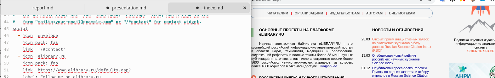
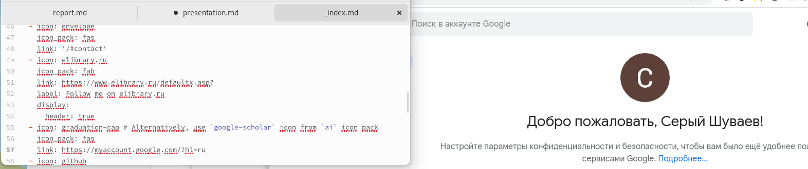
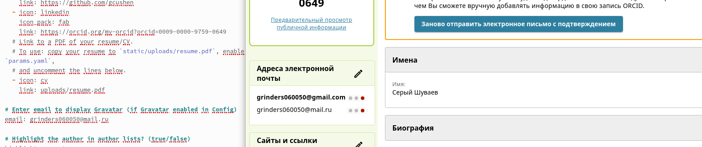
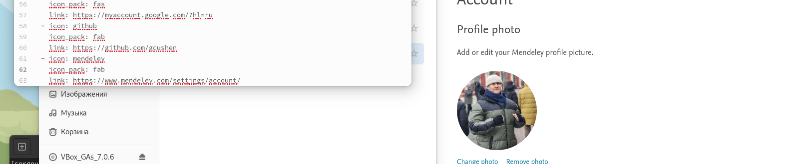
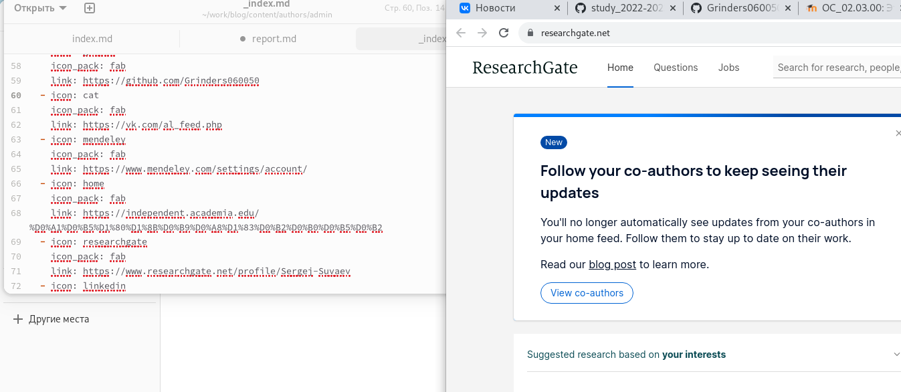
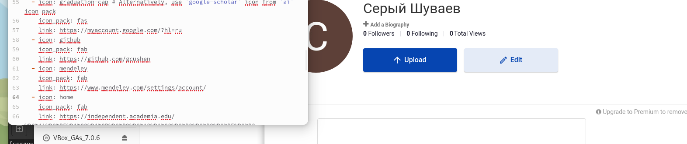
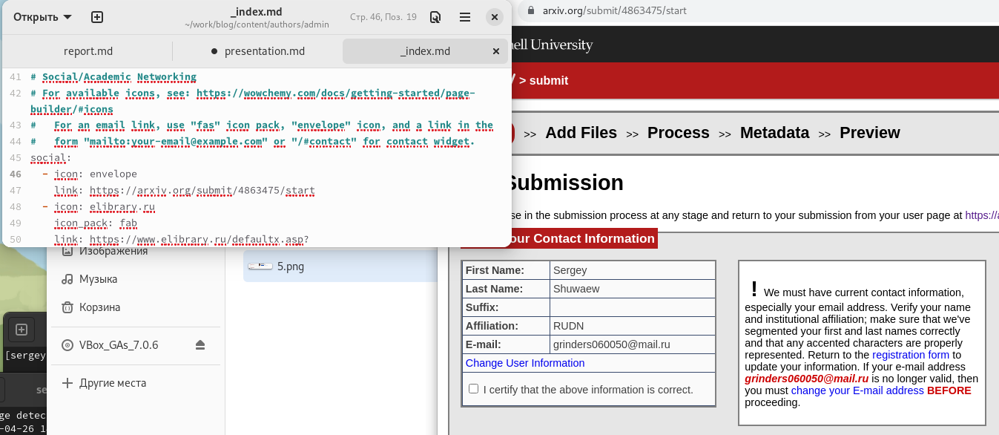
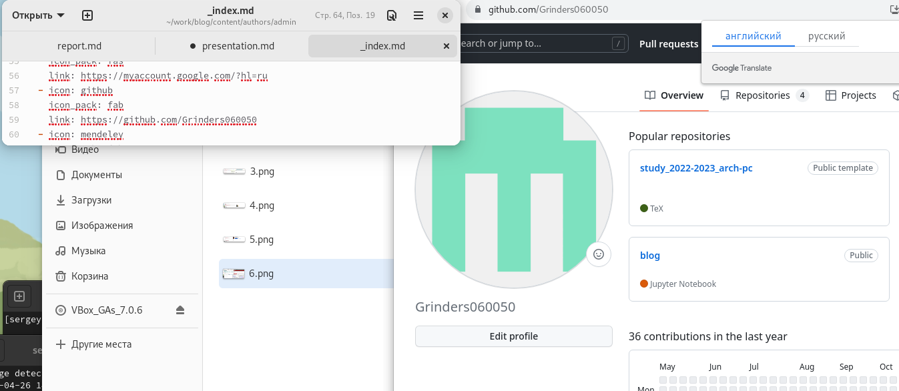

---
## Front matter
lang: ru-RU
title: "Индивидуальный проект этап 4"
subtitle: "Операционые системы"
author:
  - "Шуваев Сергей Александрович"
institute:
  - Российский университет дружбы народов, Москва, Россия
 
date: 11 07  1985

## i18n babel
babel-lang: russian
babel-otherlangs: english

## Formatting pdf
toc: false
toc-title: Содержание
slide_level: 2
aspectratio: 169
section-titles: true
theme: metropolis
header-includes:
 - \metroset{progressbar=frametitle,sectionpage=progressbar,numbering=fraction}
 - '\makeatletter'
 - '\beamer@ignorenonframefalse'
 - '\makeatother'
---

# Информация

## Докладчик

:::::::::::::: {.columns align=center}
::: {.column width="70%"}

  * Шуваев Сергей Александрович
  * Студент 1-го курса направление Фундаментальная информатика
  * Российский университет дружбы народов
  * [1032224269@pfur.ru](grinders060050@mail.ru)
  * <https://github.com/Grinders060050/Grinders060050.github.io>

:::
::: {.column width="30%"}

:::
::::::::::::::

## Цели и задачи

Зарегистрироваться на соответствующих ресурсах и разместить на них ссылки на сайте:
1. eLibrary : https://elibrary.ru/;
2. Google Scholar : https://scholar.google.com/;
3. ORCID : https://orcid.org/;
4. Mendeley : https://www.mendeley.com/;
5. ResearchGate : https://www.researchgate.net/;
6. Academia.edu : https://www.academia.edu/;
7. arXiv : https://arxiv.org/;
8. github : https://github.com/.
- Сделать пост по прошедшей неделе.
- Добавить пост на тему по выбору:
- Оформление отчёта.
- Создание презентаций.
- Работа с библиографией.

## Выполнение лабораторной работы

Так как я ранее был зарегистрирован на eLibrary ,просто захожу на ресурс,копирую и правлю информацию в файле.

## Выполнение лабораторной работы

Так как я ранее был зарегистрирован на Google Scholar ,просто захожу на ресурс,копирую и правлю информацию в файле

## Выполнение лабораторной работы

Так как я ранее был зарегистрирован на ORCID  ,просто захожу на ресурс,копирую и правлю информацию в файле

## Выполнение лабораторной работы

Так как я ранее был зарегистрирован на Mendeley ,просто захожу на ресурс,копирую и правлю информацию в файле.

## Выполнение лабораторной работы

Так как я ранее был зарегистрирован на ResearchGate  ,просто захожу на ресурс,копирую и правлю информацию в файле.

## Выполнение лабораторной работы

Так как я ранее был зарегистрирован на Academia.edu ,просто захожу на ресурс,копирую и правлю информацию в файле.

## Выполнение лабораторной работы

Так как я ранее был зарегистрирован на arXiv ,просто захожу на ресурс,копирую и правлю информацию в файле.

## Выполнение лабораторной работы

Так как я ранее был зарегистрирован на github ,просто захожу на ресурс,копирую и правлю информацию в файле.

## Выводы

Я научился добавлять данные к сайту, написанном с помощью Hugo. 
Научился добавлять и редактировать посты.

# Спасибо за внимание!!!

