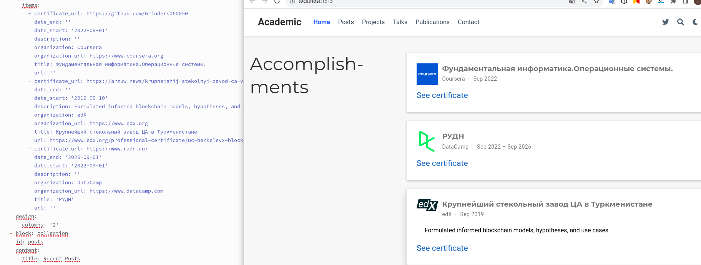

---
## Front matter
lang: ru-RU
title: "Индивидуальный проект этап 6"
subtitle: "Операционые системы"
author:
  - "Шуваев Сергей Александрович"
institute:
  - Российский университет дружбы народов, Москва, Россия
 
date: 11 07  1985

## i18n babel
babel-lang: russian
babel-otherlangs: english

## Formatting pdf
toc: false
toc-title: Содержание
slide_level: 2
aspectratio: 169
section-titles: true
theme: metropolis
header-includes:
 - \metroset{progressbar=frametitle,sectionpage=progressbar,numbering=fraction}
 - '\makeatletter'
 - '\beamer@ignorenonframefalse'
 - '\makeatother'
---

# Информация

## Докладчик

:::::::::::::: {.columns align=center}
::: {.column width="70%"}

  * Шуваев Сергей Александрович
  * Студент 1-го курса направление Фундаментальная информатика
  * Российский университет дружбы народов
  * [1032224269@pfur.ru](grinders060050@mail.ru)
  * <https://github.com/Grinders060050/Grinders060050.github.io>

:::
::: {.column width="30%"}

:::
::::::::::::::

## Цели и задачи

1. Список достижений.
2. Добавить информацию о навыках (Skills).
3. Добавить информацию об опыте (Experience).
4. Добавить информацию о достижениях (Accomplishments).
5. Сделать пост по прошедшей неделе.
6. Добавить пост на тему по выбору:
* Легковесные языки разметки.
* Языки разметки. LaTeX.
* Язык разметки Markdown.
* Добавить к сайту ссылки на научные и библиометрические ресурсы.

## Выполнение лабораторной работы

Изменяю информацию на своб собственную в файле, находящемся по пути content/authors/_index.md/, нахожу там нужные блоки и ввожу свои данные.

##Выполнение лабораторной работы

описываю и редактирую свой рабочий стаж,опыт работы и навыки.

## Выполнение лабораторной работы

Описываю места где я работал и получал навыки и опыт

## Выполнение лабораторной работы

Далее создаю пост о прошедшей неделе, начинаю редактировать файл в каталоге posts/last week/_index.md. Создаю его, копируя из другого примера поста и меняю информацию по данную тему.

## Выводы

Я научился добавлять данные к сайту, написанном с помощью Hugo. 
Научился добавлять и редактировать посты.

# Спасибо за внимание!!!

