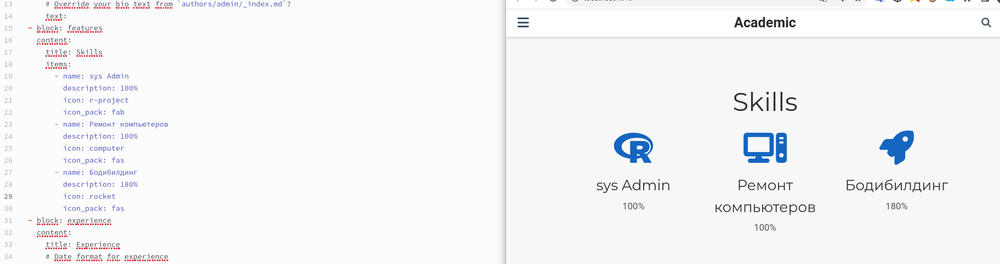

---
## Front matter
title: "Индивидуальный проект этап 6"
subtitle: "Операционые системы"
author: "Шуваев Сергей Александрович"

## Generic otions
lang: ru-RU
toc-title: "Содержание"

## Bibliography
bibliography: bib/cite.bib
csl: pandoc/csl/gost-r-7-0-5-2008-numeric.csl

## Pdf output format
toc: true # Table of contents
toc-depth: 2
lof: true # List of figures
lot: true # List of tables
fontsize: 12pt
linestretch: 1.5
papersize: a4
documentclass: scrreprt
## I18n polyglossia
polyglossia-lang:
  name: russian
  options:
	- spelling=modern
	- babelshorthands=true
polyglossia-otherlangs:
  name: english
## I18n babel
babel-lang: russian
babel-otherlangs: english
## Fonts
mainfont: PT Serif
romanfont: PT Serif
sansfont: PT Sans
monofont: PT Mono
mainfontoptions: Ligatures=TeX
romanfontoptions: Ligatures=TeX
sansfontoptions: Ligatures=TeX,Scale=MatchLowercase
monofontoptions: Scale=MatchLowercase,Scale=0.9
## Biblatex
biblatex: true
biblio-style: "gost-numeric"
biblatexoptions:
  - parentracker=true
  - backend=biber
  - hyperref=auto
  - language=auto
  - autolang=other*
  - citestyle=gost-numeric
## Pandoc-crossref LaTeX customization
figureTitle: "Рис."
tableTitle: "Таблица"
listingTitle: "Листинг"
lofTitle: "Список иллюстраций"
lotTitle: "Список таблиц"
lolTitle: "Листинги"
## Misc options
indent: true
header-includes:
  - \usepackage{indentfirst}
  - \usepackage{float} # keep figures where there are in the text
  - \floatplacement{figure}{H} # keep figures where there are in the text
---

# Цель работы

Научиться вести дневник и вносить поправки на своем персональном сайте о своем жизненном опыте и не только...

# Задание

1. Список достижений.
2. Добавить информацию о навыках (Skills).
3. Добавить информацию об опыте (Experience).
4. Добавить информацию о достижениях (Accomplishments).
5. Сделать пост по прошедшей неделе.
6. Добавить пост на тему по выбору:
* Легковесные языки разметки.
* Языки разметки. LaTeX.
* Язык разметки Markdown.
* Добавить к сайту ссылки на научные и библиометрические ресурсы.

# Теоретическое введение

Файлы для редактирования информации о себе лежат в папке content/authors/_index.md/ Здесь можно редактировать информацию об авторах на сайте, а конкретно свою. Также рядом лежит папка, где хранится аватар в дополнение о себе.
Посты создаются и редактируются в папке posts. Для каждого поста создаётся своя папка, в которой должен лежать файл _index.md, а также и изображения, доступные для данного поста.

# Выполнение лабораторной работы

{#fig:001 width=70%}

{#fig:001 width=70%}

{#fig:001 width=70%}

{#fig:001 width=70%}

# Выводы

Я научился добавлять данные к сайту, написанном с помощью Hugo. 
Научился добавлять и редактировать посты.
